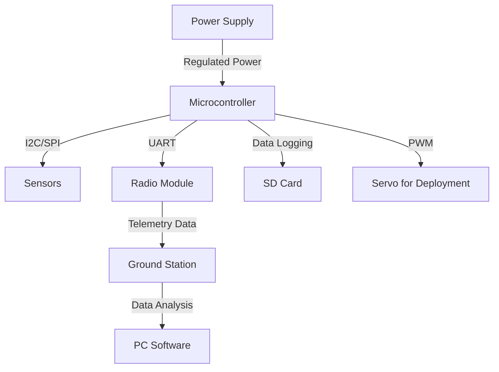

# EcoMaros CanSat Project


## Table of Contents
- [Project Overview](#project-overview)
- [System Architecture](#system-architecture)
- [Hardware Components](#hardware-components)
  - [Main Board](#main-board)
  - [Sensors](#sensors)
  - [Communication Systems](#communication-systems)
  - [Power System](#power-system)
  - [Payload and Deployment Mechanism](#payload-and-deployment-mechanism)
- [Software Architecture](#software-architecture)
  - [Microcontroller Code](#microcontroller-code)
  - [Ground Station Software](#ground-station-software)
  - [Data Processing and Telemetry](#data-processing-and-telemetry)
- [Launch and Deployment](#launch-and-deployment)
- [Testing and Validation](#testing-and-validation)
- [Contributors](#contributors)
- [License](#license)

---

## Project Overview
EcoMaros is an advanced CanSat project designed to collect atmospheric and environmental data during descent. The project is focused on precision telemetry, sensor data collection, and efficient data transmission.

This document serves as an in-depth technical guide for developers and contributors, detailing all aspects of the system architecture, software, and hardware design.

---

## System Architecture
The EcoMaros CanSat is composed of multiple subsystems working together to ensure a successful mission:
- **Sensing Unit:** Collects environmental data (temperature, pressure, humidity, altitude, etc.).
- **Processing Unit:** The microcontroller processes the sensor data and prepares it for transmission.
- **Communication Unit:** Transmits telemetry data to the ground station.
- **Power Unit:** Supplies power to all components.
- **Recovery System:** Ensures a safe landing.

### Block Diagram


---

## Hardware Components

### Main Board
The main board houses the **microcontroller**, power management circuit, sensor interfaces, and communication modules. The microcontroller used is the **[insert model]**, chosen for its low power consumption and real-time processing capabilities.

### Sensors
The EcoMaros CanSat features multiple sensors for data collection:
- **Barometric Pressure Sensor:** [insert model], measures altitude and pressure.
- **Temperature and Humidity Sensor:** [insert model], ensures accurate environmental readings.
- **Accelerometer and Gyroscope:** [insert model], used for motion tracking.
- **Magnetometer:** [insert model], helps in orientation detection.
- **GPS Module:** [insert model], provides real-time positioning.

### Communication Systems
- **Radio Module:** The CanSat uses an [insert radio model] operating at [frequency] MHz for real-time telemetry transmission.
- **Antenna:** A custom-designed dipole antenna ensures reliable data transmission.

### Power System
- **Battery:** A lightweight [insert battery type and capacity] powers the CanSat.
- **Voltage Regulation:** A [insert regulator model] ensures stable power delivery.

### Payload and Deployment Mechanism
The payload consists of a scientific experiment designed to analyze environmental parameters during descent. A servo mechanism controls the deployment of the parachute.

---

## Software Architecture

### Microcontroller Code
The firmware running on the microcontroller handles sensor data acquisition, processing, and transmission. Key functionalities include:
- Initialization of sensors and communication protocols.
- Real-time data acquisition and processing.
- Transmission of telemetry data.

```c
void setup() {
    Serial.begin(9600);
    initSensors();
    initRadio();
}

void loop() {
    readSensors();
    sendTelemetry();
    delay(1000);
}
```

### Ground Station Software
The ground station software receives telemetry data and visualizes it in real-time.

```python
import serial

def read_telemetry():
    ser = serial.Serial('COM3', 9600)
    while True:
        data = ser.readline()
        print(data.decode())
```

### Data Processing and Telemetry
Data is structured as CSV packets and stored for further analysis. The telemetry format is:
```
Timestamp, Temperature, Pressure, Altitude, Humidity, GPS_Lat, GPS_Long
```

---

## Launch and Deployment
- **Pre-launch checks:** Ensuring all systems are functional.
- **Deployment:** The CanSat is released from an altitude of 1km.
- **Data collection:** Sensors record environmental parameters during descent.

---

## Testing and Validation
Extensive testing was conducted, including:
- Bench testing of sensors.
- Range testing of the radio module.
- Drop tests to validate parachute deployment.

---

## Contributors
- **[Team Member 1]** - Lead Engineer
- **[Team Member 2]** - Software Developer
- **[Team Member 3]** - Hardware Specialist

---

## License
This project is licensed under the MIT License - see the LICENSE file for details.

---

For more details, visit our [GitHub Repository](link_to_repo).
